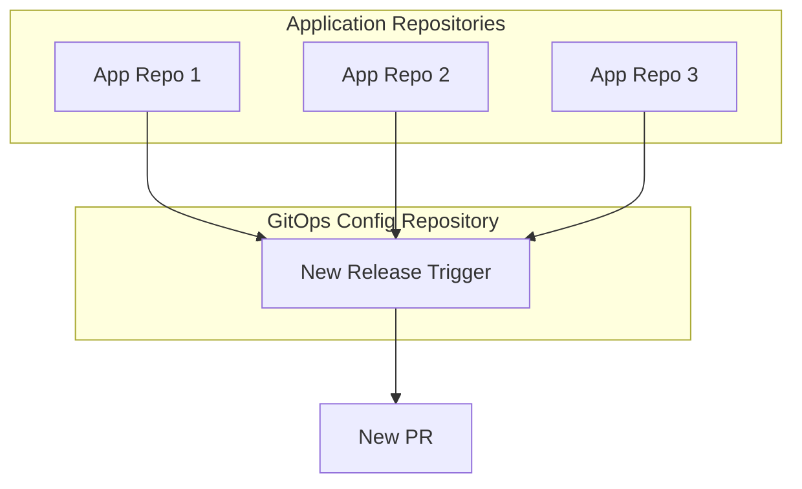
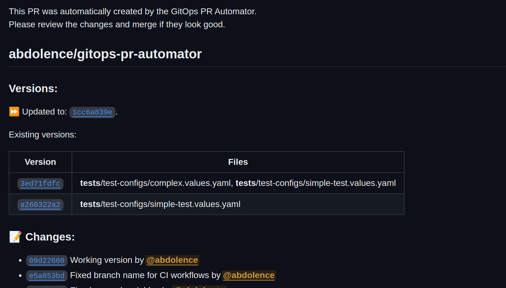

# GitOps PR Automator

[](https://github.com/super-linter/super-linter)

[](https://github.com/actions/typescript-action/actions/workflows/check-dist.yml)
[](https://github.com/actions/typescript-action/actions/workflows/codeql-analysis.yml)
[](./badges/coverage.svg)

This GitHub Action streamlines your GitOps workflow by automating the process of
updating version references within your GitOps configuration repository. By
creating pull requests (PRs) with updated versions, it helps maintain
consistency and reduces manual intervention.

A pull request is automatically created against the GitOps repository,
containing the updated version references. This PR is ready for review and
merging into your main branch, triggering your GitOps reconciliation process.

To leverage this action, you need a central GitOps repository where your
environment-specific configurations are stored.



Pull requests are created when a new release is detected in the source
repositories with changes history. 

## Usage

### Create a config file in your GitOps config repository

You can create multiple config files in your GitOps repository, each containing
different references to the source repositories and other parameters

```yaml
# Unique identifier for the configuration, important to have unique ids for each
# configuration and it will be used to create branch names
id: gitops-pr-automator
# Parameters for the PRs created
pullRequest:
  title: 'GitOps automated release'
  githubLabels:
    - gitops
    - gitops-test
  enableAutoMerge: 'squash'
  pullRequestComment: |
    This PR was automatically created by the GitOps PR Automator.
    Please review the changes and merge if they look good.
# Source repositories to monitor for new releases
sourceRepos:
  - repo: abdolence/gitops-pr-automator # Repository to monitor
    ref: heads/master # Branch to monitor
    releaseFiles: # Files to monitor for new releases in GitOps config repository
      - path: '**/*.values.yaml' # Glob syntax to match files
        # Regex to both match and replace the version in the file
        # The regex leverages lookbehind and lookahead assertions
        # to match the version string and replace it
        regex:
          - '(?<=(tag: ))[a-f0-9]{40}(?=(.*))'
```

This configuration file will monitor the `abdolence/gitops-pr-automator`
repository for new releases on the `master` branch. When a new release is
detected, the action will create a PR in the GitOps config repository with the
updated version references in the `*.values.yaml` files in GitOps config
repository. You can specify multiple `sourceRepos` in the configuration file to
monitor.

Pay attention to the `regex` field in the configuration file which describes
both:

- How to match the version string in the file
- How to replace the version string in the file

In this example, the action will look for a string of 40 hexadecimal characters
following `tag:` and replace it with the new version. You can specify multiple
`regex` in the configuration file to match and replace.

### Create a GitHub Action workflow in your GitOps config repository

Create a GitHub Action workflow in your GitOps repository that uses this action.

```yaml
name: GitOps PR Automator
on:
  workflow_dispatch:

concurrency:
  group: ${{ github.workflow }}-${{ github.event.inputs.project_type }}
  cancel-in-progress: true

jobs:
  create-pr:
    name: Create a PR with updated version references
    runs-on: ubuntu-latest

    permissions:
      contents: write
      pull-requests: write

    steps:
      - name: Checkout
        id: checkout
        uses: actions/checkout@v4

      - name: Create GitOps PR
        id: create-pr
        uses: abdolence/gitops-pr-automator@v1
        with:
          github-token: ${{ secrets.GITHUB_TOKEN }}
          config-path: '.github/gitops/gitops-pr-automator.config.yaml'
```

### Trigger the action from your source repositories

Update the source repositories to trigger the action when a new release is
detected with this step.

```yaml
      - name: Trigger GitOps PR automation
        if: github.ref_protected
        uses: actions/github-script@v6
        with:
          github-token: ${{ secrets.GH_TRIGGER_WORKFLOWS }}
          script: |
            await github.rest.actions.createWorkflowDispatch({
             owner: '<your-github-owner>',
             repo: '<your-gitops-config-repo>',
             workflow_id: '<gitops-workflow-file-name>.yaml',
             ref: 'master'
          })
```

## Licence

Apache Software License (ASL)

## Author

Abdulla Abdurakhmanov
